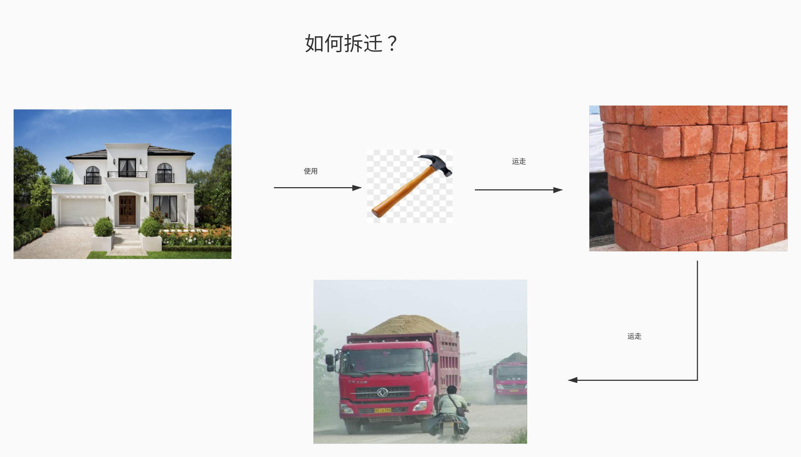

# ProgramTheory 编程理论基础

## 目录
- 变量
- 运算
- 方法 (函数)
- 逻辑
- 循环

### 前置导论
如何拆迁


### 变量

编程中的变量 就像现实生活中的运载车   搬运砖头 => 搬运数据
```go
var CarriageNo1 Brick  
var 运载车1号 砖头  
这里我们定义了 一个变量    名称:   运载车1号  可装载货物: 砖头
```

**`var` 是定义变量的语法**
```go
   var 变量名称  变量类型
   
   var 布加迪威龙 cat 
```

### 运算
```go
var teacher_wang age  // 定义一个名为 王老师 的变量 类型为 age

teacher_wang = 18  //  `=` 赋值运算符 ， 使用 `=` 将王老师的 年龄设置 为 18
```

### 方法(函数)
解决问题的一个动作的描述
```go
func 版砖() {
    // 方法体
    把砖块扳动... 描述版砖动作  当程序调用时 会按照你指定的动作运行
}
```

**`func` 为方法的定义语法**
```go
func 方法名() {
    // 方法体: 描述该方法具体的行为
}
```

**如何调用方法**
``` 
版砖()  // 这样就调用了  ， 程序会按照你指定的动作运行
```

**那我们要把砖头搬到某处呢?**
伪代码: 
```go
var 东厂仓库 砖头仓库   // 定义一个名为 东厂仓库 的变量 ， 类型为砖头仓库
东厂仓库 = 10块砖头  // 把10块砖头搬到东厂仓库
var 西厂仓库 砖头仓库 // 定义一个名为 西厂仓库 的变量 ， 类型为砖头仓库

func 版砖(出发地 , 目的地 ) {  // 定义一个 版砖方法, 他们接受两个参数,  出发地, 目的地
    var 转运站 砖头仓库  // 定义一个名为 转运站 的变量 ， 类型为砖头仓库
    转运站 = 出发地  // 将出发地的砖头 搬到 转运站
    目的地 = 转运站  // 将转运站的砖头 搬到 出发地
}

// 我们调用上面的搬转方法进行搬运
版砖(东厂仓库,西厂仓库)
```
代码:
```go
type 砖头 struct{} // 定义砖头

func 版砖(出发地 []砖头, 西厂仓库 []砖头) { // 定义一个 版砖方法, 他们接受两个参数,  出发地(类型砖头仓库), 目的地(类型砖头仓库)
    var 转运站 []砖头  // 定义一个名为 转运站 的变量 ， 类型为砖头仓库
    转运站 = 出发地
    西厂仓库 = 转运站
}

func main() {
    var 东厂仓库 []砖头 // 定义 东厂仓库
    var 西厂仓库 []砖头 // 定义 西厂仓库
    东厂仓库 = append(东厂仓库, 砖头, 砖头, 砖头, 砖头, 砖头)  // 将5个砖头 搬到 东厂仓库
    
}
```

### 逻辑
```go
var teacher_wang age  // 定义一个名为 王老师 的变量 类型为 age
teacher_wang = 16 

if: 如果, else: 否则

if teach_wang == 18 {  // 定义条件
    打印到屏幕("teach_wang 18岁")    
} else {  // 当上面条件不满足时执行   
    打印到屏幕("teach_wang 不是18岁")    
}

if teach_wang == 18 { // 定义条件
    打印到屏幕("teach_wang 18岁")    
}else if teach_wang > 18 {  // 当上面条件不满足时 看看这个条件是否满足
    打印到屏幕("teach_wang > 18岁")
}else { // 都不满足指向这个
    打印到屏幕("teach_wang < 18岁")  
}
```

### 循环
循环: 循环往复  一只做一个事情
```go
for {  // for 是循环语法
    // 循环体
    版砖()  
}

//这代码写的 就一直在版砖 , 当然不可能一值版砖 砖头搬完了 要退出 

var 砖头数量 int // 定义一个 名为 砖头数量 的变量 类型为int整数
for {
    if 砖头数量 != 0 {
        版砖() 
    }else {
        break  // break 是跳出循环的语法
    }   
}

打印到屏幕("完成版砖")  
```


### 作业
写一个拆迁程序的伪代码

参考答案:
```go 

var 尖沙小区 砖头 // 定义一个名为 尖沙小区的 变量 类型为砖头
var 运载车1号 砖头  

func 拆迁(小区, 运载车辆) {
    运载车1号 = 尖沙小区
}

拆迁(尖沙小区, 运载车1号)
```


