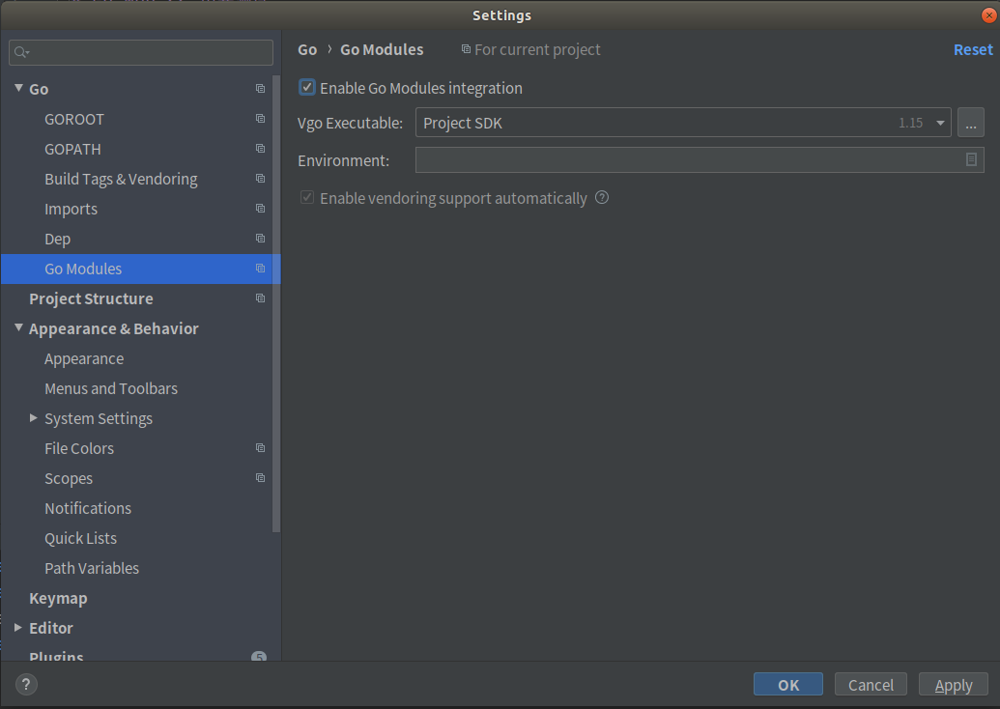
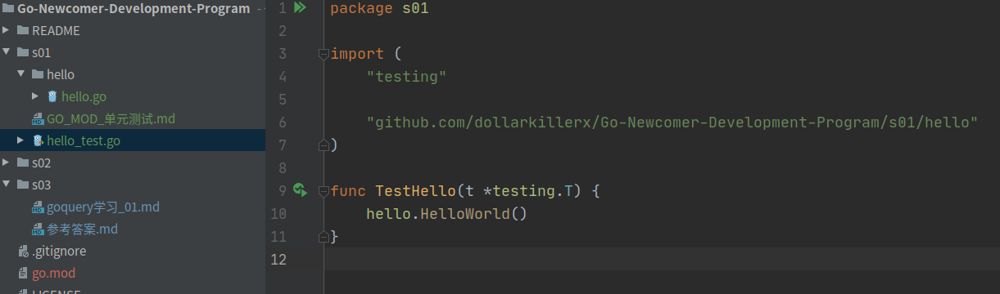

# GO MOD && 单元测试
## GO MOD 
GoMod为go的包管理工具  新建项目后 我们可以在当前项目下通过
`go mod init 项目地址` 进行创建Go mod  

比如我们当前这个项目`github.com/dollarkillerx/Go-Newcomer-Development-Program`

当前目录下就会多一个`go.mod`的文件
```
module github.com/dollarkillerx/Go-Newcomer-Development-Program 

go 1.15   # 这个代表当前系统GO的版本
```
因为GO大多数库都在国外  本地拉取可能非常慢 可以阅读https://goproxy.io/zh/  配置加速

注意： 如果你使用Goland做开发 需要去设置勾选开启GO MOD


### namespace
- 一个目录就代表一个namespace
目录结构
```
- a
    - a.go 
- main.go
go.mod  //  module github.com/dollarkillerx/study
```
a.go
```go 
package a  // 这个是包名 同一个目录下包名必须 相同 ， 推荐包名为目录名
import "fmt"  // 导入fmt标准库

func init() {             // 如果有导入此包 就会先执行此包的Init函数
    fmt.Println("A init")
}

func HelloWorld() {
    fmt.Println("Hello World")
}
```
main.go
```main.go 
package main
import "github.com/dollarkillerx/study/a"  // 导入apackage

fn main() {
    a.HelloWorld()  
}
```
自己联系一下包的导入把


- 大写开头是Public 小写是 Private
```go 
func HelloWrold() {   // 大写开头 代表其他包导入是可以调用的
    fmt.Println("你好")
}

func helloWorld() {   // 这个是私有方法
    fmt.Println("你好")
}
```

### 单元测试
单元测试需要 限定文件名称： `测试模块_test.go`

内容限定：
```go 
func TestHello(t *testing.T) {  // t *testing.T 代表单元测试 ， 方法名规范 Test测试模块
	hello.HelloWorld()
}
```



### 使用第三方包  
go编写配置文件一般推进yaml  go官方并没有提供yaml标准解析库  我们需要使用第三方库

我们这里使用`https://gopkg.in/yaml.v3` 这个库对yaml进行解析
``` 
Getting started
To get the package, execute:

go get gopkg.in/yaml.v3
To import this package, add the following line to your code:

import "gopkg.in/yaml.v3"
Refer to it as yaml.

For more details, see the API documentation.
```
阅读上面内容 我们可以得之  
安装次库 当项目的当前目录下运行  `go get gopkg.in/yaml.v3`
此时发现go.mod 文件发生了变动 多了一条
``` 
module github.com/dollarkillerx/Go-Newcomer-Development-Program

go 1.13

// 新增 这个代表 当前项目依赖  后面是版本号
require gopkg.in/yaml.v3 v3.0.0-20200615113413-eeeca48fe776 // indirect   
```
我们现在使用这个库对yaml进行解析
```go 
func TestYaml(t *testing.T) {
	fileBytes, err := ioutil.ReadFile("./config.yaml") // 这里使用ioutil来去读这个文件  ioutil.ReadFile会将此文件完整的读取到内存中 ,如果是大文件切忌使用改API
	if err != nil {
		log.Fatalln(err)
	}
	cfg := &config{}
	if err := yaml.Unmarshal(fileBytes, cfg); err != nil { // 调用Unmarshal方法进行解析  传入 yaml文件,要解析成的struct的指针
		log.Fatalln(err)
	}

	log.Println(cfg) // 打印我们解析的结构体
}
```